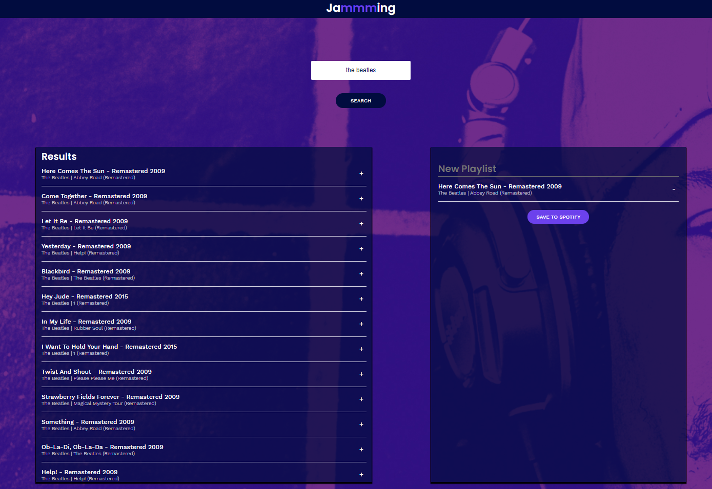

# Jamming
## A React Project

This project is a small React web app that uses the Google Authenticator API and the Spotify API to search for tracks and manage playlists on Spotify.

This was the final project in a React development boot camp I did with Codecademy. I started this boot camp before I went back to school for computer science. It helped me learn a lot of basics as well as some in depth stuff with JS and React. Doing this is defiantly what motivated me to want to go back to school.

A lot of the assets and the style sheet for this project was provided for us, but all the rest was written by me. This is the first time I had worked with promise chains and that is what was the most challenging at the time.

